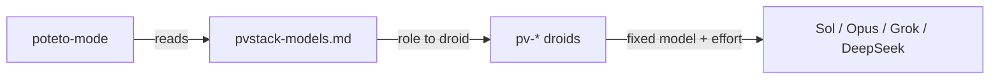

# pvstack

pvstack is [Lauren Tan's pstack](https://github.com/cursor/plugins/tree/main/pstack) for [Droid](https://docs.factory.ai), with every role's model chosen from [VulcanBench](https://vulcanbench.com) data instead of one lab's defaults.

pstack is a set of rigorous engineering workflows. You start a task with `/poteto-mode`. It picks a playbook (bug fix, feature, investigation, perf, babysit, and others) and calls `how`, `why`, `architect`, `interrogate`, `arena` and the principle skills as each step needs them. pvstack keeps those skills close to upstream and changes two things:

1. **It runs on Droid.** One mapping file translates Cursor's tools and Task parameters to Droid's.
2. **It routes each role to the model that VulcanBench shows is the best value for that kind of work.** You can choose from six modes, or write a custom preset.

## Playbook

New to pstack? [The pvstack Playbook](playbook/index.html) walks you through it, with one path for a new project (greenfield) and one for an existing codebase (brownfield). It works with any agent that can load skills. Agents can read [playbook/llms.txt](playbook/llms.txt) and [playbook/playbook.md](playbook/playbook.md) to guide you through it. To change it, edit `playbook/src/content.mjs` and run `npm run playbook`.

## Modes

Each mode is a preset: a rule per role class, resolved over the cells in `tools/droids.mjs` and their VulcanBench rows. The table below is generated from `tools/presets.mjs`. After `npm run vulcanbench`, run `npm run presets`, `npm run evidence` and `npm run playbook` so the sheets, `docs/model-evidence.md` and the playbook match the new snapshot.

<!-- presets:table -->
| Role | Balanced (default) | Budget | Quality | Fast | Safe | Open |
| --- | --- | --- | --- | --- | --- | --- |
| Code delegates (feature, refactor, bug fix, perf, hillclimb) | GPT-6.1 Sol, high | DeepSeek V4.1 Flash, high | Grok 4.7, xhigh | GPT-6.1 Sol, high | GPT-6.1 Sol, high | DeepSeek V4.1 Flash, high |
| Swarm workers | GPT-6.1 Sol, high | DeepSeek V4.1 Flash, high | Grok 4.7, xhigh | GPT-6.1 Sol, high | GPT-6.1 Sol, high | DeepSeek V4.1 Flash, high |
| Exploration, investigators, mechanical edits | GPT-6.1 Sol, low | DeepSeek V4.1 Flash, low | GPT-6.1 Sol, high | GPT-6.1 Sol, low | GPT-6.1 Sol, low | DeepSeek V4.1 Flash, low |
| Judgment, prose, explainers, synthesizers | Claude Opus 5.5, medium | Claude Opus 5.5, medium | Claude Opus 5.5, high | Claude Opus 5.5, medium | Claude Opus 5.5, medium | DeepSeek V4.1 Flash, high |
| Hardest changes | Grok 4.7, xhigh | Claude Opus 5.5, medium | Grok 4.7, xhigh | GPT-6.1 Sol, high | Claude Opus 5.5, high | DeepSeek V4.1 Flash, high |
| Reflect tooling | GPT-6.1 Sol, xhigh | GPT-6.1 Sol, high | Grok 4.7, xhigh | GPT-6.1 Sol, high | GPT-6.1 Sol, xhigh | DeepSeek V4.1 Flash, high |
| Review panels | Claude Opus 5.5, medium · GPT-6.1 Sol, xhigh · Grok 4.7, high | GPT-6.1 Sol, high · DeepSeek V4.1 Flash, low · Grok 4.7, high (cross-judge pool: Claude Opus 5.5, medium · GPT-6.1 Sol, high · Grok 4.7, high) | Claude Opus 5.5, high · GPT-6.1 Sol, xhigh · Grok 4.7, xhigh | Claude Opus 5.5, medium · GPT-6.1 Sol, high · Grok 4.7, high | Claude Opus 5.5, medium · GPT-6.1 Sol, xhigh · Grok 4.7, high | DeepSeek V4.1 Flash, max · DeepSeek V4.1 Flash, high · DeepSeek V4.1 Flash, low |
<!-- /presets:table -->

The reasons and numbers behind each choice are in [docs/model-evidence.md](docs/model-evidence.md). In short:

- GPT-6.1 Sol at high effort passes every Frontier v4 task at 97% of Opus 5.5's best score, for about 1/10 of the cost.
- Opus 5.5 at medium effort is within 0.25 points of its best, and it scores higher than its own xhigh and max levels.
- Grok 4.7 has the top three scores on Frontier v4. At xhigh it scores 93.15 and passes every task, so Balanced gives it the hardest changes. Against Sol at high, Grok at high takes about 2.5 times as long and at least 7 times the estimated cost. At xhigh it takes about 2.8 times as long and at least 9 times the cost. So Sol keeps everyday code.
- DeepSeek V4-Flash was one of the strongest and cheapest cells on VulcanBench's v3 board. pvstack's own Droid run of VulcanBench's Python Suite v1 (345 runs) found DeepSeek V4.1 Flash at high effort resolving as many tasks as GPT-6.1 Sol at low on about half the credits. Max effort cost twice as much as high and resolved no more, so Budget runs code on high. See [Measured in Droid](docs/model-evidence.md#measured-in-droid).
- Quality ignores cost and takes the top score on the board. Fast takes the quickest cell that still passes all but one task.
- Safe keeps Grok 4.7 off judgment, code and the hardest changes, because Safety v1 shows it followed planted notes it never reported. Open stays on open-weights models, which today means DeepSeek V4.1 Flash on every role.

## Custom presets

A custom preset is a JSON file that extends one of the built-in modes. Put it at `~/.factory/pvstack-presets/<name>.json`, or at `.factory/pvstack-presets/<name>.json` in a project. `/setup-pvstack` lists the custom presets it finds and can write a new one with you.

`plugins/pvstack/skills/setup-pvstack/examples/cheap-safe.json` extends Budget and asks for the cheapest cell that passes the Safety v1 screen and every task it ran:

```json
{
  "summary": "Budget costs with a Safety v1 screen on code delegates.",
  "extends": "budget",
  "rules": {
    "code": { "where": { "safe": true, "passed": "all" }, "pick": "min-usd" }
  },
  "pins": []
}
```

`rules` is keyed by role class (`code`, `explore`, `judgment`, `hardest`, `reflect tooling`, `panels`) or by a single role. `pick` is `min-usd`, `max-score` or `min-minutes`, and `where` filters the cells that pick sorts. `pins` overrides one role with a named droid (a `pv-*` droid, a personal droid, or `inherit`), and every pin needs a `reason`. The name must not collide with a built-in one.

The resolver that ships in the plugin validates and explains presets without writing anything. It reads the plugin's own copy of the cell data, so it works from the installed plugin alone:

```bash
cd ~/.factory/plugins/cache/pvstack-*/skills/setup-pvstack
node scripts/resolve.mjs --list
node scripts/resolve.mjs --explain cheap-safe
node scripts/resolve.mjs cheap-safe
```

`/setup-pvstack` writes the sheet that resolves. If a custom preset file later disappears, skills fall back to its `extends` base.

## Install

```bash
droid plugin marketplace add NDilanka/pvstack
droid plugin install pvstack@pvstack --scope user
```

Then, in a Droid session:

```text
/setup-pvstack
/poteto-mode this pr has a subtle bug where the scroll drifts every 750ms even when idle. repro first, then fix and verify.
```

`/setup-pvstack` writes `~/.factory/pvstack-models.md`. Without it, pvstack uses Balanced.

To pick up new commits, run `droid plugin update pvstack@pvstack --scope user`. Droid runs the installed copy from its plugin cache, not from a local clone.

In headless `droid exec`, the Task tool is blocked below `--auto high`, so playbooks that delegate do their work in the parent instead. Interactive sessions spawn subagents at any autonomy level.

## How routing works

Droid's Task tool has no per-call model parameter, so each model and effort pair is a droid: `pv-sol-high`, `pv-opus-medium`, `pv-ds-max`, and so on. These map directly to the VulcanBench columns. The role sheet maps each pstack role to one of those droids. To change a role, edit the sheet or re-run `/setup-pvstack`. To use a model that no `pv-*` droid covers, add a personal droid and point the role at it.



## Staying current with upstream

pvstack follows `cursor/plugins/pstack` directly. The pinned commit is in [UPSTREAM.md](UPSTREAM.md).

```bash
node tools/sync-upstream.mjs --ref main   # pull Lauren's latest, re-pin
npm run check                             # sync drift, droids, sheets, links
```

A weekly GitHub Action does this for you. When upstream pstack changes, it pushes the sync to the `upstream-sync` branch and opens a pull request with the diff summary and the `npm run check` result. Later upstream changes refresh the same pull request, unless you have pushed your own fixes to the branch; then it only comments. If `main` catches up another way, it closes the pull request. Run it on demand from the Actions tab (workflow `upstream sync`). It needs the repository setting "Allow GitHub Actions to create and approve pull requests".

The sync rewrites only the files it copied from upstream, which are listed in `plugins/pvstack/.upstream-files.json`. The pvstack layer is never overwritten:

- `plugins/pvstack/droids/pv-*.md`, generated from `tools/droids.mjs`
- `plugins/pvstack/skills/setup-pvstack/`
- `plugins/pvstack/skills/poteto-mode/references/droid-tools.md`

## Layout

```text
.factory-plugin/marketplace.json
plugins/pvstack/
  .factory-plugin/plugin.json
  skills/        upstream skills + setup-pvstack + droid-tools.md
  droids/        poteto-agent, comment-sicko (upstream) + pv-* (pvstack)
  docs/upstream/ upstream's pstack guide
docs/model-evidence.md
data/            vulcanbench.json (the board snapshot), catalog.mjs (hand-curated evidence)
tools/           sync-upstream.mjs, droids.mjs, validate.mjs, vulcanbench.mjs, presets.mjs, evidence.mjs
.github/workflows/ check.yml (npm run check), upstream-sync.yml (weekly)
```

## Credits

pvstack is built on the work of two people. Neither of them is affiliated with this project.

### pstack, by Lauren Tan

Every workflow in pvstack comes from Lauren Tan's pstack: `poteto-mode`, its playbooks, `how`, `why`, `architect`, `arena`, `interrogate`, and the principle skills. Lauren works at Cursor, previously worked at Meta and Netflix, and is on the React core team, where she helps build React Compiler.

- pstack source: https://github.com/cursor/plugins/tree/main/pstack
- The pstack guide: https://github.com/cursor/plugins/blob/main/pstack/docs/guide/README.md
- The Complete Guide to pstack: https://x.com/poteto/article/2094457600259842065
- GitHub: [@poteto](https://github.com/poteto) · X: [@poteto](https://x.com/poteto)

pstack is MIT-licensed, © 2026 Lauren Tan. Her license is in [`plugins/pvstack/LICENSE-pstack`](plugins/pvstack/LICENSE-pstack), and [NOTICE.md](NOTICE.md) lists which files come from pstack and what pvstack changes in them.

### VulcanBench, by Morgan Linton

Every model and effort choice in pvstack comes from VulcanBench, an open-source benchmark for real engineering tasks. It reports token use, time and cost alongside scores. Morgan Linton, cofounder and CTO of Bold Metrics, built it and runs it. pvstack cites VulcanBench's published numbers in [docs/model-evidence.md](docs/model-evidence.md) and doesn't redistribute its data.

- VulcanBench: https://vulcanbench.com
- Leaderboard: https://vulcanbench.com/leaderboard.html
- Methodology: https://vulcanbench.com/methodology.html
- Open-source harness: https://github.com/morganlinton/VulcanBench
- Morgan Linton: https://www.morganlinton.com · GitHub: [@morganlinton](https://github.com/morganlinton)

VulcanBench is free and runs on sponsorships. If pvstack's routing saves you money, consider [sponsoring VulcanBench on GitHub](https://github.com/sponsors/morganlinton).
