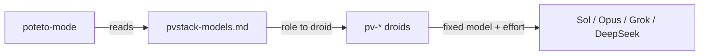

# PV Stack

PV Stack is [Lauren Tan's pstack](https://github.com/cursor/plugins/tree/main/pstack) for [Droid](https://docs.factory.ai), with every role's model chosen from [VulcanBench](https://vulcanbench.com) data instead of one lab's defaults.

pstack is a set of rigorous engineering workflows. You start a task with `/poteto-mode`. It picks a playbook (bug fix, feature, investigation, perf, babysit, and others) and calls `how`, `why`, `architect`, `interrogate`, `arena` and the principle skills as each step needs them. PV Stack keeps those skills close to upstream and changes two things:

1. **It runs on Droid.** One mapping file translates Cursor's tools and Task parameters to Droid's.
2. **It routes each role to the model that VulcanBench shows is the best value for that kind of work.** You can choose from two modes.

## Modes

| Role | Balanced (default) | Budget |
| --- | --- | --- |
| Code delegates (feature, refactor, bug fix, perf, hillclimb) | GPT-6.1 Sol, high | DeepSeek V4.1 Flash, max |
| Swarm workers | GPT-6.1 Sol, high | DeepSeek V4.1 Flash, high |
| Exploration, investigators, mechanical edits | GPT-6.1 Sol, low | DeepSeek V4.1 Flash, low |
| Judgment, prose, explainers, synthesizers | Claude Opus 5.5, medium | Claude Opus 5.5, medium |
| Hardest changes | Claude Opus 5.5, high | Claude Opus 5.5, medium |
| Reflect tooling | GPT-6.1 Sol, xhigh | GPT-6.1 Sol, high |
| Review panels (arena, architect, interrogate) | Opus 5.5 · Sol xhigh · Grok 4.7 | Sol high · DeepSeek max · Grok 4.7 |

The reasons and numbers behind each choice are in [docs/model-evidence.md](docs/model-evidence.md). In short:

- GPT-6.1 Sol at high effort passes every Frontier v4 task at 97% of Opus 5.5's best score, for about 1/10 of the cost.
- Opus 5.5 at medium effort is within 0.25 points of its best, and it scores higher than its own xhigh and max levels.
- DeepSeek V4-Flash was one of the strongest and cheapest cells on VulcanBench's v3 board.

## Install

```bash
droid plugin marketplace add NDilanka/pvstack
droid plugin install pvstack@pvstack --scope user
```

Then, in a Droid session:

```text
/setup-pvstack
/poteto-mode this pr has a subtle bug where the scroll drifts every 750ms even when idle. repro first, then fix and verify.
```

`/setup-pvstack` writes `~/.factory/pvstack-models.md`. Without it, PV Stack uses Balanced.

After you edit the plugin source, run `droid plugin update pvstack@pvstack --scope user`. Droid runs the installed copy from its plugin cache, not from this repository.

In headless `droid exec`, the Task tool is blocked below `--auto high`, so playbooks that delegate do their work in the parent instead. Interactive sessions spawn subagents at any autonomy level.

## How routing works

Droid's Task tool has no per-call model parameter, so each model and effort pair is a droid: `pv-sol-high`, `pv-opus-medium`, `pv-ds-max`, and so on. These map directly to the VulcanBench columns. The role sheet maps each pstack role to one of those droids. To change a role, edit the sheet or re-run `/setup-pvstack`. To use a model that no `pv-*` droid covers, add a personal droid and point the role at it.



## Staying current with upstream

PV Stack follows `cursor/plugins/pstack` directly. The pinned commit is in [UPSTREAM.md](UPSTREAM.md).

```bash
node tools/sync-upstream.mjs --ref main   # pull Lauren's latest, re-pin
npm run check                             # sync drift, droids, sheets, links
```

The sync rewrites only the files it copied from upstream, which are listed in `plugins/pvstack/.upstream-files.json`. The PV Stack layer is never overwritten:

- `plugins/pvstack/droids/pv-*.md`, generated from `tools/droids.mjs`
- `plugins/pvstack/skills/setup-pvstack/`
- `plugins/pvstack/skills/poteto-mode/references/droid-tools.md`

## Layout

```text
.factory-plugin/marketplace.json
plugins/pvstack/
  .factory-plugin/plugin.json
  skills/        upstream skills + setup-pvstack + droid-tools.md
  droids/        poteto-agent, comment-sicko (upstream) + pv-* (PV Stack)
  docs/upstream/ upstream's pstack guide
docs/model-evidence.md
tools/           sync-upstream.mjs, droids.mjs, validate.mjs
```

## Credits

pstack is by Lauren Tan ([@poteto](https://x.com/poteto)), MIT-licensed. Benchmark data is from Morgan Linton's VulcanBench. See [NOTICE.md](NOTICE.md).
